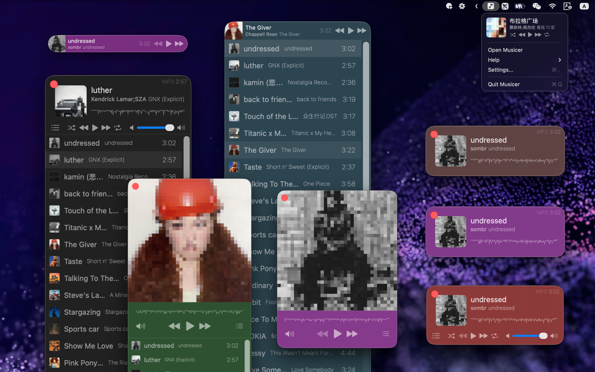
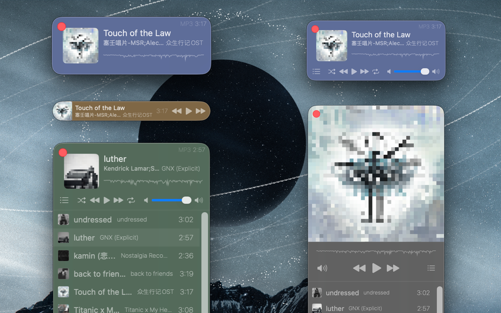

<!--idoc:ignore:start-->
> [!TIP]
> Declaration: This project is not an open-source project. The repository serves as the official website, used to collect issues and user demands. This is done to save costs, because without an official website, the application cannot pass the review.
<!--idoc:ignore:end-->

   
   
  
  <h1>
    Musicer
  </h1>
  <!--rehype:style=border: 0;-->
  

    <a href="./README.zh.md">简体中文</a> • 
    <a target="_blank" href="https://github.com/jaywcjlove/musicer/issues/new?template=bug_report.yml">Contact & Support</a> • 
    <a href="https://github.com/jaywcjlove/musicer/releases">Changelog</a>
  

  

    
  

Mini and convenient local music player, lightweight and practical, specially designed for playing local audio, supports a variety of common audio formats, enjoy your music anytime, anywhere!

### Features

- Support local audio file playback
- Waveform progress bar to display playback progress
- Customize player theme color
- One-click switch to mini mode
- Display and control player in the status bar

Supported formats: MP3, AIFF, AMR, WAV, CAF, AAC, AC3, FLAC, M4R, M4A, etc.