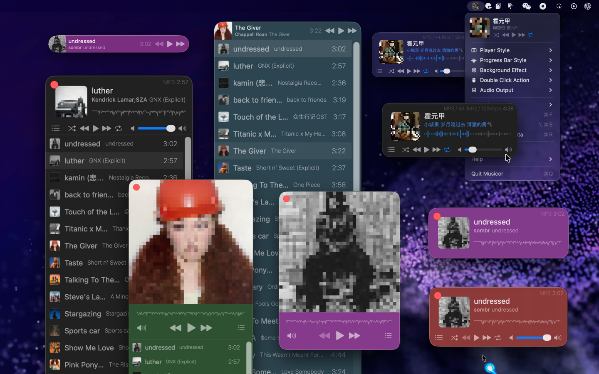
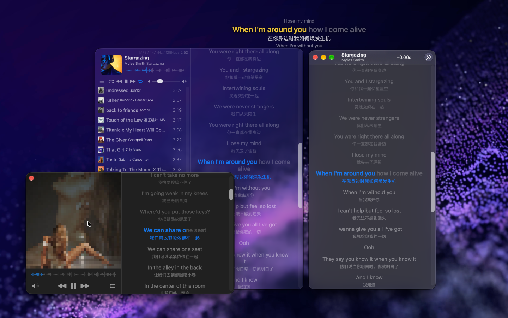
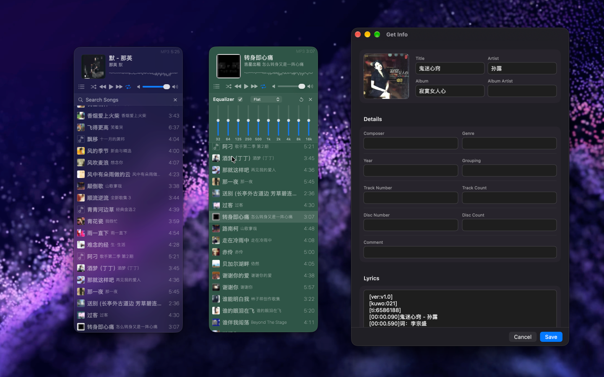

<!--idoc:ignore:start-->
> [!TIP]
> 声明：此项目并非开源项目，仓库作为官方网站，用于收集问题和用户需求。这样做是为了节省成本，因为没有官网，应用无法通过审核。
<!--idoc:ignore:end-->

<div align="center">
  <br />
  <br />
  
  <h1>
    Musicer
  </h1>
  <!--rehype:style=border: 0;-->
  <p>
    <a href="./README.md">English</a> • 
    <a target="_blank" href="https://github.com/jaywcjlove/musicer/issues/new?template=bug_report_cn.yml">联系&支持</a> • 
    <a href="./CHANGELOG.zh.md">更新日志</a>
  </p>
  <p>
    <a target="_blank" href="https://jaywcjlove.github.io/maslink/?id=6745227444" title="Musicer for macOS">
      
    </a>
  </p>
</div>








迷你便捷的本地音乐播放器，轻巧实用，专为播放本地音频而设计，支持多种常见音频格式，随时随地畅听您的音乐！

### 核心功能

- 支持本地音频文件播放
- 波形进度条显示播放进度
- 自定义播放器主题颜色
- 一键切换迷你模式
- 可在状态栏中显示并控制播放器

支持格式：MP3, AIFF, AMR, WAV, CAF, AAC, AC3, FLAC, M4R, M4A 等

### Musicer，拥抱AI能力

Musicer 支持 **[MCP](https://modelcontextprotocol.io)（模型上下文协议，Model Context Protocol）**。将它接入 Claude、Cursor、Grok 等 AI 客户端后，你就可以用自然语言实现音乐搜索、播放、暂停、切歌，还能读取当前播放曲目以及歌词。

#### 在 Grok 中配置

```bash
# 添加 Musicer MCP 服务器
$ grok mcp add Musicer \
  --transport stdio \
  --scope user \
  -- "/System/Applications/Musicer.app/Contents/MacOS/Musicer" --mcp
# 移除 Musicer MCP 服务器
$ grok mcp remove musicer
# 列出已配置的 MCP 服务器
$ grok mcp list
# 诊断 Musicer MCP 服务器的连接状态
$ grok mcp doctor Musicer
```

直接在配置(`vim ~/.grok/config.toml`)中配置：

```ini
[mcp_servers.musicer]
command = "/Applications/Musicer.app/Contents/MacOS/Musicer"
args = ["--mcp"]
enabled = true
```

也可以将以下内容添加到 MCP 客户端配置中(Claude Desktop、Cursor等)：

```json
{
  "mcpServers": {
    "musicer": {
      "command": "/Applications/Musicer.app/Contents/MacOS/Musicer",
      "args": ["--mcp"]
    }
  }
}
```

<!--idoc:config:
title: Musicer 你便捷的本地音乐播放器
description: 迷你便捷的本地音乐播放器，轻巧实用，专为播放本地音频而设计，支持多种常见音频格式，随时随地畅听您的音乐！
keywords: music,player,local,audio,offline,waveform,mini,toolbar
-->