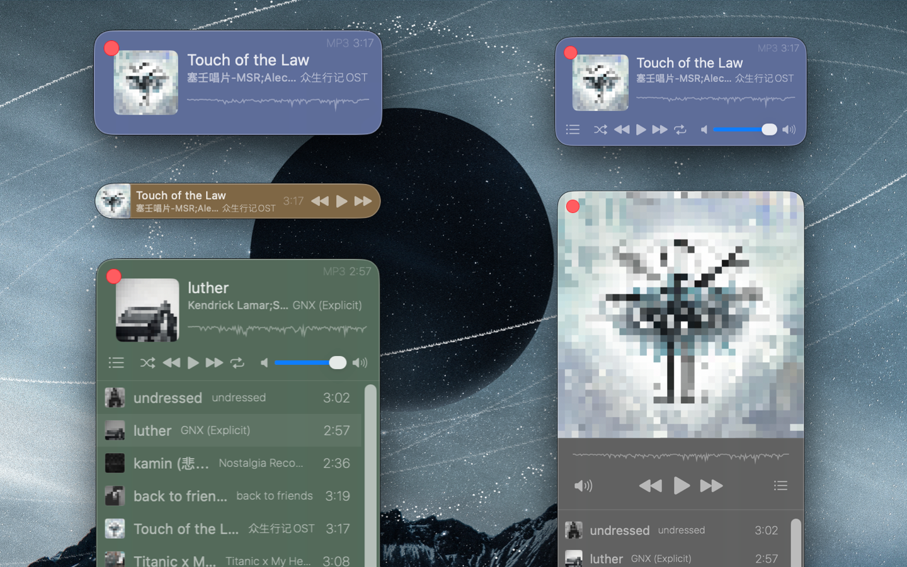

<!--idoc:ignore:start-->
> [!TIP]
> 声明：此项目并非开源项目，仓库作为官方网站，用于收集问题和用户需求。这样做是为了节省成本，因为没有官网，应用无法通过审核。
<!--idoc:ignore:end-->

   
   
  
  <h1>
    Musicer
  </h1>
  <!--rehype:style=border: 0;-->
  

    <a href="./README.zh.md">简体中文</a> • 
    <a target="_blank" href="https://github.com/jaywcjlove/musicer/issues/new?template=bug_report_cn.yml">联系&支持</a> • 
    <a href="./CHANGELOG.zh.md">更新日志</a>
  

  

    
  

迷你便捷的本地音乐播放器，轻巧实用，专为播放本地音频而设计，支持多种常见音频格式，随时随地畅听您的音乐！

### 核心功能

- 支持本地音频文件播放
- 波形进度条显示播放进度
- 自定义播放器主题颜色
- 一键切换迷你模式
- 可在状态栏中显示并控制播放器

支持格式：MP3, AIFF, AMR, WAV, CAF, AAC, AC3, FLAC, M4R, M4A 等
